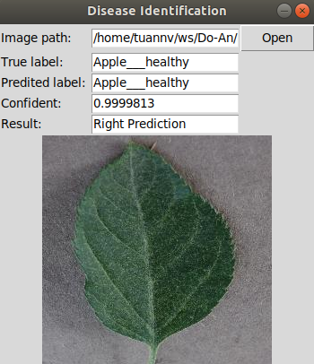

# Image classification
The purpose of this project to used CNN network to solve a classification problem. The dedicated application is identifying plant disease from leaf image.

<p align="center">
  
</p>

## Usage

For cloud trainning, this project include Colab.ipynb file which is used to train the model with Colab.

For normal tranning, this project need python tensorflow or tensorflow-gpu to be pre-installed:

* Install cuda toolkit 10.0
* Install cuda cudnn7
* Install tensorfow-gpu

You need to retrain the model yourself:

To test the model:
```
python3 gui.py
```

### Result:

```
[test loss, test acc] = [0.38438466123360043, 0.90295553]
```

## Authors

* **Ngo Van Tuan** - *Initial work* - [tuannv](https://github.com/tuanngo0898)

## License

This project is licensed under the MIT License.
